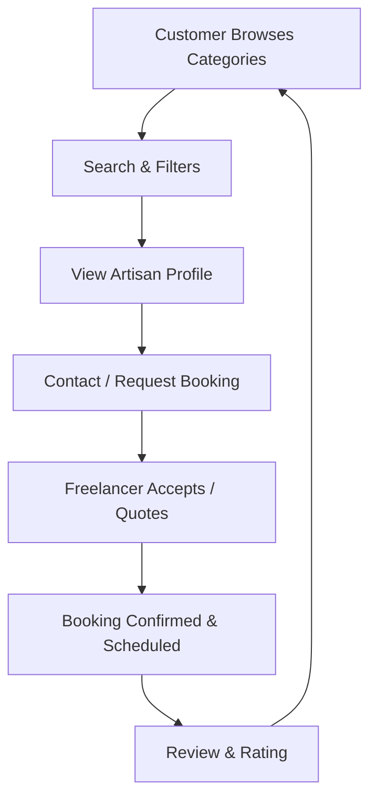
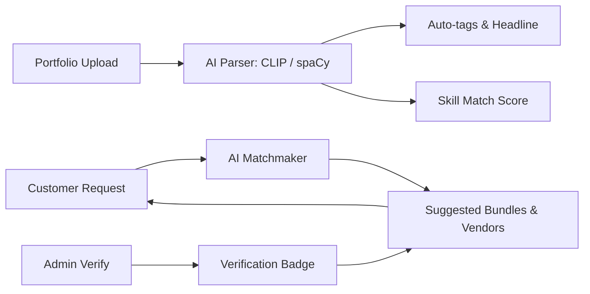
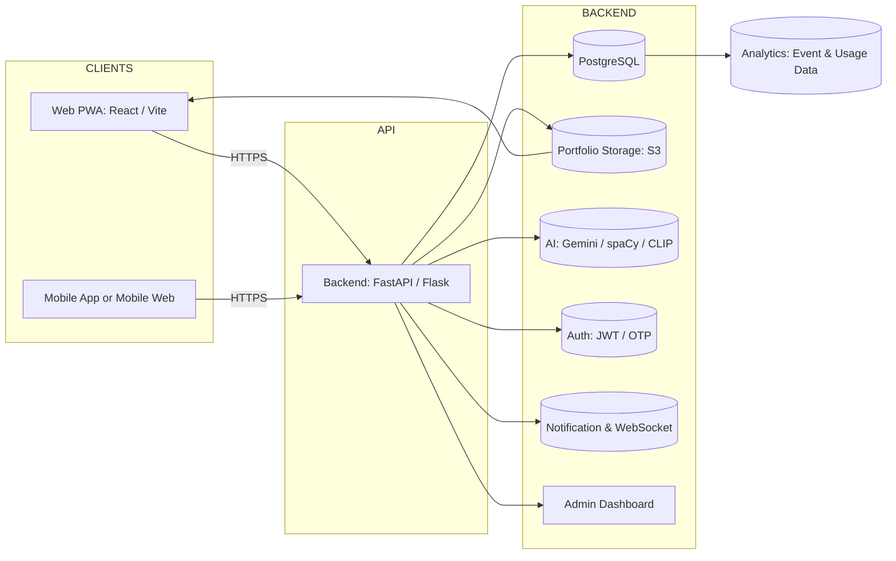

# 🎨 Talentino — Local-first Marketplace for Freelance Artisans

**Team InnovateX**  
👩‍💻 Project Leader: **Lasya Korandla**

**One-stop artisan discovery, booking & bundle-building platform**  
(Decorators, bakers, musicians, potters, sketchers, makeup artists, tutors & more)

  
  

---

## 🚀 One-line Pitch
**Talentino — a local-first platform where freelance artisans register, showcase work, and get direct bookings with AI-powered matching and bundle-builder for events.**

---

## 🎯 Problem & Opportunity

- 🎭 Many artisans lack discoverability, structured profiles, and frictionless booking flows.  
- 🎉 Event planners need an easy way to find complementary vendors (e.g., decorator + baker).  
- 📉 Existing marketplaces are broad or product-focused, not artisan-centric.  
- ✅ Opportunity: community-driven UX, trust signals (reviews, verification), frictionless contact, and AI matching.

---

## 🧭 Target Users

- **Freelancers / Artisans:** decorators, bakers, musicians, makeup artists, potters, sketchers, tutors, anchors.  
- **Customers:** people planning birthdays, small weddings, cafes, restaurants, corporate events.  
- **Admins / Moderators:** verification, category management, fraud monitoring.

---

## 🧩 Core Features (MVP)

- Registration & profile (bio, skills, portfolio, contact).  
- Category pages with filters (price, distance, rating).  
- Direct contact (in-app chat or WhatsApp / phone deep-links).  
- Booking request flow (accept / decline / quote).  
- Ratings & reviews + basic verification badges.  
- Admin dashboard.  
- AI helpers: auto-tags, portfolio summaries, pricing suggestions.  
- AI user-side: bundle builder & auto-match.

---

## 🏗 System Flow: User Journey

  

Tech Stack
Frontend: React (Vite) + Tailwind CSS (PWA-ready)
Backend: Python (FastAPI) or Flask, REST APIs
DB: PostgreSQL (+ MongoDB optional for document storage)
Storage: AWS S3 / Firebase Storage for portfolios
Auth: JWT + OAuth + OTP (Twilio / Firebase)
Messaging: Socket.IO for real-time chat; WhatsApp deep-link for quick contact
AI: Gemini / spaCy / CLIP for profile parsing, auto-tags, image tagging
DevOps: Docker, GitHub Actions, Vercel (frontend) / AWS or GCP (backend)
Monitoring: Sentry, Grafana, Prometheus

✅ Unique Hackathon Features & Differentiators
Bundle Builder: book multiple complementary artisans for an event in one flow.
AI Instant Quotes: auto-suggested quotes & template replies for freelancers.
Portfolio Stories: auto-generated 30s reels with AI captions from portfolio images.
Verification Badge: trust-building via admin checks + optional background checks.
Skill Match Score: AI-powered fit score (1–5) shown on profiles.
WhatsApp Deep-links: immediate contact fallback for low-friction conversions.

🔐 Risks & Mitigations
Low supply of artisans → Incentivized onboarding drives, social campaigns, revenue share promos.
Trust & quality concerns → Verification badges, reviews, dispute resolution & admin moderation.
Payment/regulatory issues → Start contact-only MVP; add payments after compliance checks.
Fraud / toxicity → AI-based content moderation & fraud detection pipeline.

💸 Business & Sustainability
Freemium: basic listing free for artisans; premium promoted listings & analytics for a fee.
Transaction Fee (post-MVP): small commission on bookings (optional).
CSR & Partnerships: collaborate with local communities, events, and cultural hubs.
Marketplace Add-ons: promoted bundles, featured categories, sponsored events.

📈 Feasibility & Why This Will Work
✅ MVP is straightforward: CRUD, search, booking & chat are attainable within hackathon timelines.

✅ AI adds quick differentiation: auto-tags, match scores, reel demos make the product sticky.

✅ Low barrier to adoption: WhatsApp deep-links and mobile-first UX reduces friction for both artisans and customers.

✅ Growth channels: event partnerships, local community outreach, social proof & influencer activations.

🧪 Hackathon Demo Checklist
Landing page with categories & sample artisan profiles
Category search + filters (price, distance, rating)
Contact flow → WhatsApp deep-link or in-app chat demo
Admin panel: approve a freelancer (verification badge)
AI demo: paste a short bio → show auto-tags and suggested headline
Bundle builder prototype (select decorator + baker + musician)
README + short pitch slides + demo script

🎯 Quick API Endpoints (Key)
POST /auth/register — Register user / artisan
POST /auth/login — Login (JWT)
GET /freelancers — List with filters (category, distance, price)
POST /freelancers — Create / Update profile (portfolio upload)
POST /bookings — Create booking request
PATCH /bookings/:id — Update status (accept/decline/quote)
POST /ai/parse-profile — Return auto-tags & headline
GET /admin/pending — Admin: list pending verifications

📌 Final Notes / Tagline Ideas
Talentino — Where Local Talent Finds Opportunity
Talentino — Book Artisans. Build Events. Celebrate Local.
�

⭐ Team InnovateX — Project Lead: Lasya Korandla
